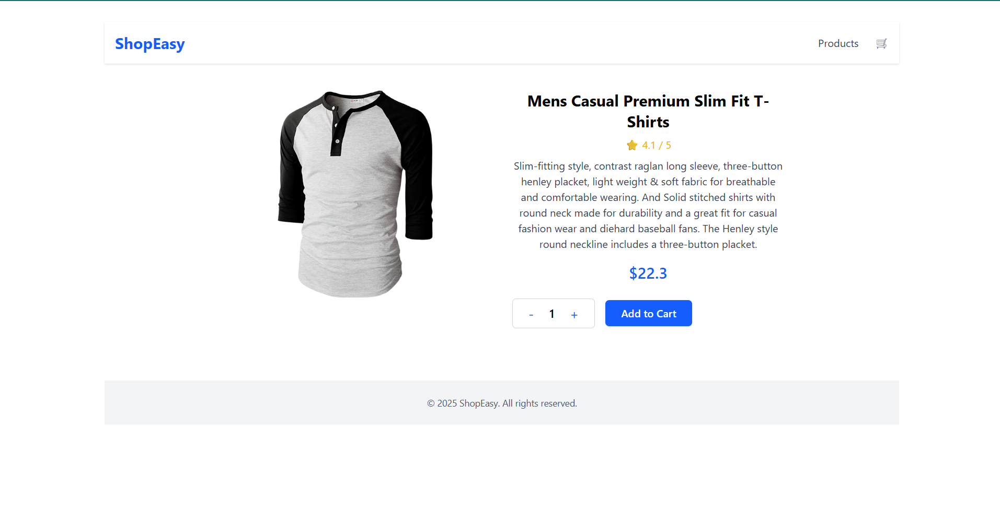
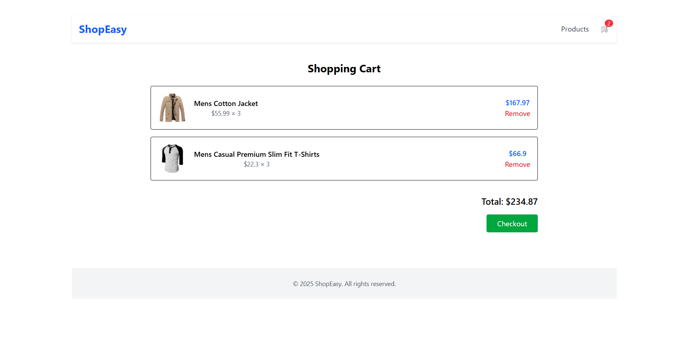

---

## 2️⃣ E-commerce Cart App

````markdown
# 🛒 React E-commerce Cart

A simple e-commerce cart built using React and FakeStore API. Users can view products and add them to their cart.

## 🚀 Features

- Fetch products from FakeStore API
- Display products with details
- Add items to cart
- View cart with item count

## 🛠️ Tech Stack

- React
- FakeStore API
- CSS

## 📷 Screenshot





## ⚙️ Installation

```bash
git clone https://github.com/MannJariwala/React-E-Commerce-Cart.git
cd ecommerce-cart
npm install
npm start
```
````
